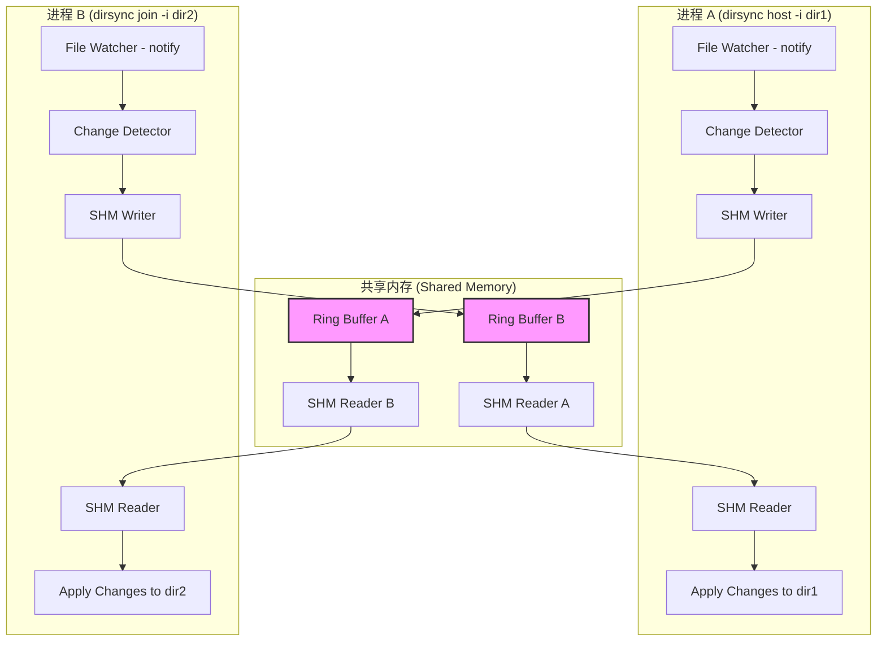
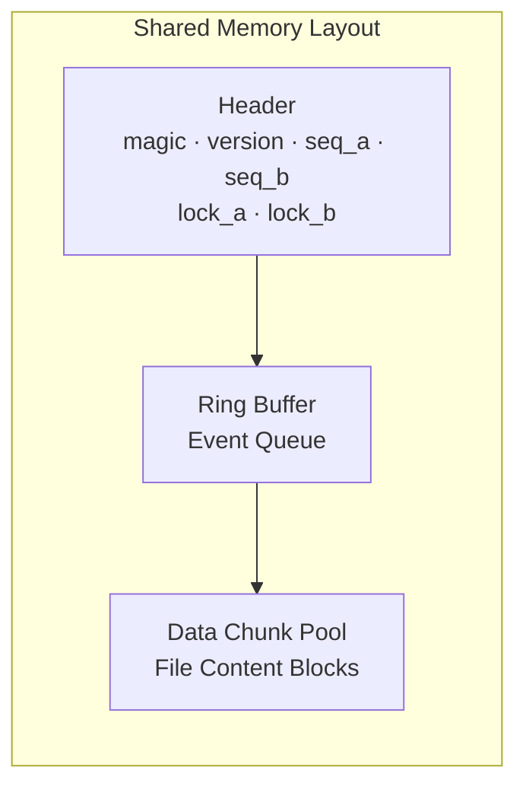
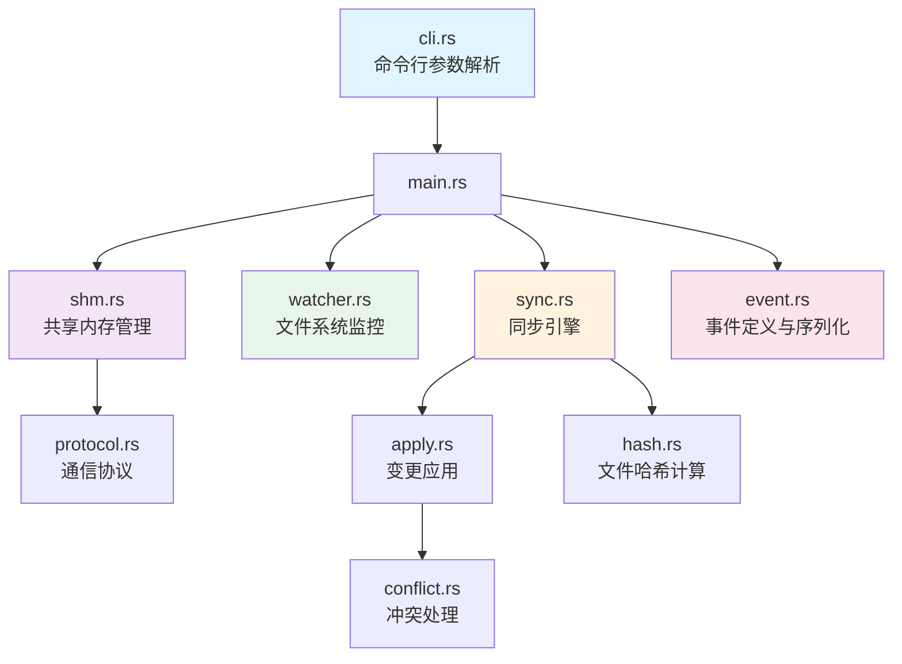
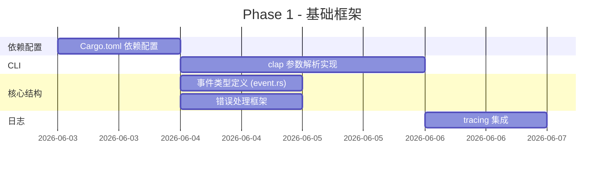
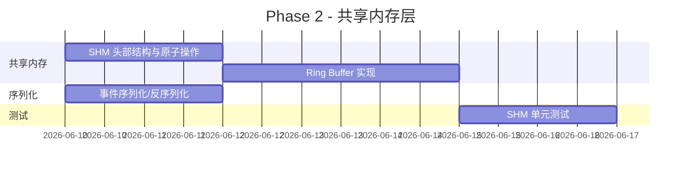
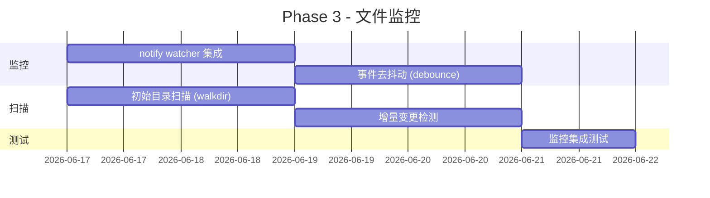
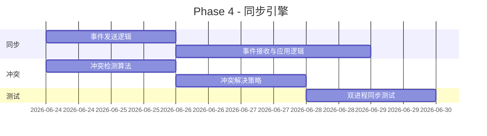
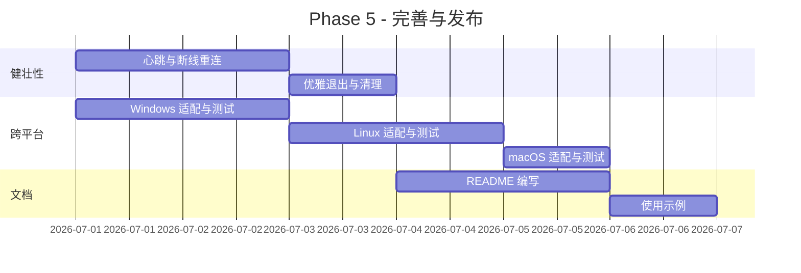
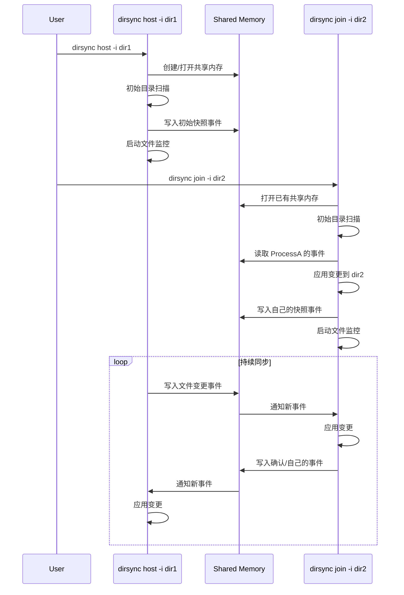
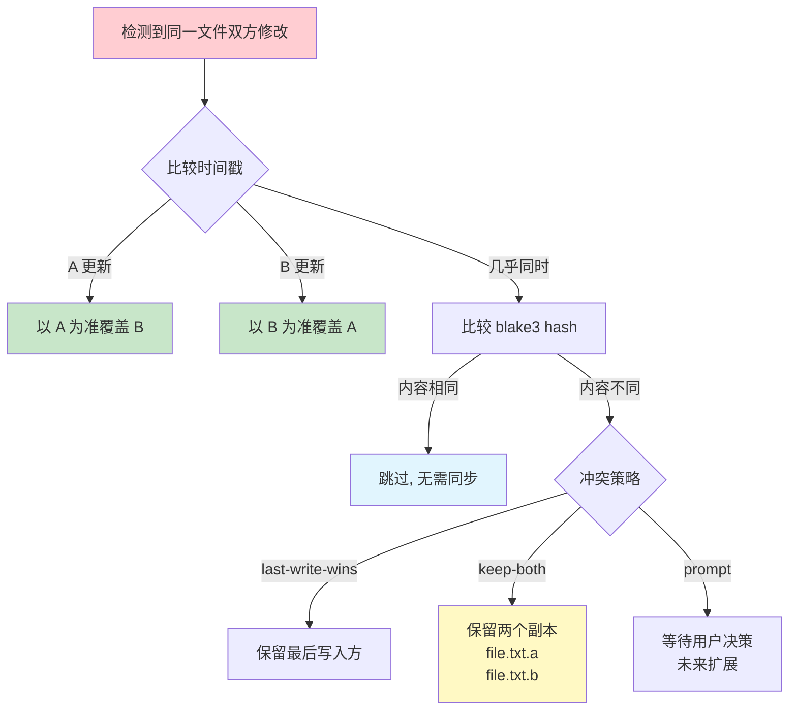

# DirSync - Directory Sync over Shared Memory

## 概述

`dirsync` 是一个基于共享内存（Shared Memory）的目录同步 CLI 工具。两个进程各自监控一个目录，通过共享内存交换文件变更事件，实现近实时的双向目录同步。

## 架构设计

### 整体架构



### 共享内存通信协议



### 模块结构



## 技术栈

| 组件 | Crate | 版本 | 用途 |
|------|-------|------|------|
| CLI 解析 | `clap` | 4.x | 命令行参数与子命令 |
| 文件监控 | `notify` | 8.x | 跨平台文件系统事件 |
| 共享内存 | `shared_memory` | 0.12 | 进程间共享内存 |
| 目录遍历 | `walkdir` | 2.x | 递归目录扫描 |
| 文件哈希 | `blake3` | 1.x | 快速文件内容哈希 |
| 序列化 | `bincode` + `serde` | 2.x / 1.x | 事件序列化 |
| 日志 | `tracing` | 0.1 | 结构化日志 |
| 异步运行时 | `tokio` | 1.x | 异步 IO 与定时器 |
| 错误处理 | `anyhow` | 1.x | 错误上下文 |

## 共享内存协议设计

### 内存布局

```
Offset  Size     Field
------  -------  ---------------------------
0x00    4        Magic Number (0x4453594E "DSYN")
0x04    4        Protocol Version
0x08    8        Sequence Number A (进程A写入计数)
0x10    8        Sequence Number B (进程B写入计数)
0x18    4        Lock A (原子操作)
0x1C    4        Lock B (原子操作)
0x20    4        Ring Buffer Write Offset
0x24    4        Ring Buffer Read Offset A
0x28    4        Ring Buffer Read Offset B
0x2C    4        Ring Buffer Capacity
0x30    4        Data Pool Write Offset
0x34    4        Data Pool Size
0x38    ...      Ring Buffer (事件队列)
...     ...      Data Pool (文件内容块)
```

### 事件类型

```rust
enum SyncEvent {
    FileCreated { path, content_hash, size },
    FileModified { path, content_hash, size },
    FileDeleted { path },
    DirCreated { path },
    DirDeleted { path },
    FileContent { path, offset, data },      // 大文件分块传输
    Heartbeat { timestamp },                  // 心跳检测
}
```

## 开发计划

### Phase 1: 基础框架 (Week 1)



**任务清单:**
- [ ] 配置 `Cargo.toml` 所有依赖
- [ ] 实现 CLI 参数解析 (`host/join`, `-i <dir>`, `--shm-name`, `--shm-size`, `--verbose`)
- [ ] 定义 `SyncEvent` 枚举及序列化
- [ ] 集成 `anyhow` 错误处理
- [ ] 集成 `tracing` 日志

### Phase 2: 共享内存层 (Week 2)



**任务清单:**
- [ ] 实现共享内存头部结构（magic, version, sequence, locks）
- [ ] 实现无锁 Ring Buffer（基于原子操作）
- [ ] 实现事件序列化到 Ring Buffer
- [ ] 实现事件反序列化从 Ring Buffer
- [ ] 大文件分块写入 Data Pool
- [ ] 单元测试：读写一致性

### Phase 3: 文件监控 (Week 3)



**任务清单:**
- [ ] 集成 `notify` crate 实现文件监控
- [ ] 实现事件去抖动（50-100ms 窗口）
- [ ] 实现初始目录全量扫描
- [ ] 实现增量变更检测（基于 mtime + blake3 hash）
- [ ] 过滤 `.git`, `node_modules` 等目录
- [ ] 集成测试

### Phase 4: 同步引擎 (Week 4)



**任务清单:**
- [ ] 实现事件发送（本地变更 → SHM）
- [ ] 实现事件接收（SHM → 应用到目标目录）
- [ ] 实现文件复制/创建/删除操作
- [ ] 实现冲突检测（双方同时修改同一文件）
- [ ] 实现冲突解决策略（last-write-wins / 保留双方副本）
- [ ] 双进程端到端测试

### Phase 5: 完善与发布 (Week 5)



**任务清单:**
- [ ] 心跳机制（进程存活检测）
- [ ] 断线重连与状态恢复
- [ ] 优雅退出（SIGINT/SIGTERM 处理）
- [ ] 共享内存资源清理
- [ ] Windows / Linux / macOS 跨平台测试
- [ ] README 文档
- [ ] 使用示例与截图

## 核心流程

### 启动流程



### 冲突处理流程



## 跨平台注意事项

| 平台 | 共享内存实现 | 文件监控 | 路径分隔符 |
|------|-------------|---------|-----------|
| Linux | `/dev/shm` (POSIX shm) | inotify | `/` |
| macOS | POSIX shm | FSEvents | `/` |
| Windows | Named File Mapping | ReadDirectoryChangesW | `\` |

## 性能目标

- 事件延迟: < 10ms（本地 SHM 读写）
- 大文件: 分块传输，支持 > 1GB 文件
- 目录规模: 支持 > 100,000 文件
- 内存占用: 默认 64MB 共享内存池

## 风险与对策

| 风险 | 影响 | 对策 |
|------|------|------|
| SHM 残留未清理 | 内存泄漏 | 注册退出钩子，强制清理 |
| 原子操作竞态 | 数据损坏 | 使用 `AtomicU64` + CAS |
| 符号链接循环 | 死循环 | 检测 symlink，限制深度 |
| 文件锁定 | 同步失败 | 重试机制 + 跳过策略 |
| 编码问题 | 路径乱码 | 统一使用 UTF-8 |
